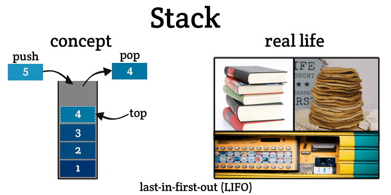
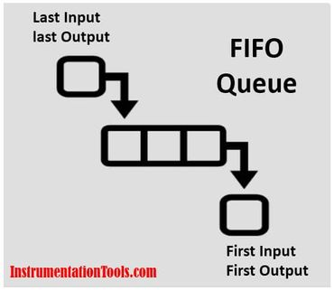

<table>
<tr>
<td>
    <table align="center">
        <tr>
            <td>
                Time
            </td>
            <td>
                Level
            </td>
        </tr>
        <tr>
            <td>
                O(1)
            </td>
            <td>
                Excellent
            </td>
        </tr>
        <tr>
            <td>
                O(log<sub>N</sub>)
            </td>
            <td>
                Good
            </td>
        </tr>
        <tr>
            <td>
                O(N)
            </td>
            <td>
                Fair
            </td>
        </tr>
        <tr>
            <td>
                O(N<sup>2</sup>)
            </td>
            <td>
                Poor (Bubble)
            </td>
        </tr>
        </table>
</td>
<td>
    <h1 align="center" fill="blue" id="searching">Searching and Sorting👀</h1>
</td>
</tr>

<tr>
<td>
<h3>Linear Search

- Sequential search order
- Time complexity based on # of elements
- Time Complexity: O(N)</h3>
</td>
<td>

```java
// linear(new String[]{"Alaska", "Ireland", "Niagra Falls"}, "Ireland")
public static int linear(String[] arr, String key){
    int result = -1;
    for (String e : arr){
        if (e == key) {
            result = 1;
            break;
        }
    }
    return result; // 1
}
```

</td>
</tr>
<tr>
<td>


<h3>Binary Search

- Array MUST BE SORTED
- Recursive
- Time Complexity: O(log<sub>N</sub>)
- Faster</h3>
</td>
<td>

```java
// binarySearch(new int[]{1,2,3,4,5,6,7,8,9}, 2) 
public static int binarySearch(int arr[], int key){  
    int first = 0;
    int last = arr.length;
    int mid = (first + last)/2;  

    while( first <= last ){  

        if ( arr[mid] < key ){  
            first = mid + 1;     
        }else if ( arr[mid] == key ){  
            break;  
        }else{  
            last = mid - 1;  
        }  
        mid = (first + last)/2; 

    }  
    // return -1 if not found, or found
    return ( first > last ) ? -1 : mid;
}
```
</td>
<tr>
<td>
</td>
<td>

</td>
</tr>


<tr>
<td>
<h2>Bubble Sort</h2>

- Double for loop
- Swaps out larger element
- Time Complexity: O(N<sup>2</sup>)

</td>
<td>

```java
// linear(new String[]{"Alaska", "Ireland", "Niagra Falls"}, "Ireland")
// bubble_sort(new int[]{3,4,2,1,9,9,7,6,5}) ;
public static void bubble_sort(int[] arr){
    int temp = 0;
    for (int j = arr.length-1; j > 1; j--){
        for( int i= 0; i < j; i++){
            if (arr[i] > arr[i+1]){
                temp = arr[i];
                arr[i] = arr[i+1];
                arr[i+1] = temp;
            }
        }

    }
    // 123456799
}
```

</td>
</tr>

<tr>
<td>
<h3>Selection Sort</h2>

- Improvement on bubbe sort
- Reduces # of swaps
- Less memory
- Time Complexity: O(N<sup>2</sup>)

</td>
<td>

```java
// linear(new String[]{"Alaska", "Ireland", "Niagra Falls"}, "Ireland")
//selection_sort(new int[]{3,4,2,1,9,9,7,6,5}) 
public static void selection_sort(int[] arr){
    // forward loop
    for (int i = 0; i < arr.length-1; i++){
        int min = i;
        for(int j = i+1; j < arr.length; j++){
            //if left is greater than right, swap
            if (arr[j] < arr[min]) {
                min = j;
            }
        }
        // swap
        int temp = arr[i];
        arr[i] = arr[min];
        arr[min] = temp;
        
    }
    // 123456799
}
```
</td>
</tr>

<tr>
<td>
<h2>Insertion Sort</h2>

- somewhat the best
- twice as fast as bubble
- Time Complexity: O(N<sup>2</sup>)

</td>
<td>

```java
    // insertion_sort(new int[]{3,4,2,1,9,9,7,6,5})
    public static void insertion_sort(int[] arr)    {
        int n = arr.length;
        for (int i = 1; i < n; ++i) {
            int key = arr[i];
            int j = i - 1;
            while (j >= 0 && arr[j] > key) {
                arr[j + 1] = arr[j];
                j = j - 1;
            }
            arr[j + 1] = key;
        }
         // 123456799
    }
```
</td>
</tr>
</table>
<!-- sorting graphs -->
<div align="center">
<!-- data structures -->

</div>
<div align="center">
<!-- sorting algos -->

</div>
<hr/>
<!-- 
ARRAYS
 -->
<h1>
    🟦🟪Arrays🟪🟦
</h1>

```java
public class Arry {
    String arr[];
    // Object objArray[];
    // Collection[] collectionArray;
    public Arry(String[] e){
        // String[] quotes = {"Hello", "You're", "Awesome"};
        // char charArr[] = new char[]{ 'A', 'B', 'C' };
        arr = new String[5];
        arr = e;
    }
    @Override
    public String toString(){
        String result = "";
        for (String i : arr) result+=(String.format("'%s', ", i));
        return result;
    }
    void read(){
        // LOOP THROUGH
        // for (int i=0; i<arr.length; i++){
        //     System.out.println(arr[i]);
        // }
        // or
        String result = "";
        for (String i : arr) result+=(String.format("'%s', ", i));
        System.out.println(result);
    }
    void update(int i, String str) { arr[i] = str; }
    void delete(String str){
        for (int i=1; i<arr.length; i++){
            if (arr[i-1] == str){
                arr[i-1] = arr[i];
            }
        }
    }
    public static void main(String[] args) {
        Arry test = new Arry(new String[]{"Alaska", "Ireland", null});
        test.toString(); // [I@4617c264
        test.read();
        test.update(test.arr.length-1, "Niagra Falls");
        test.read();
        test.delete("Ireland");
        test.read();
    }

}
```
<hr />

<!-- 
ARAYLIST AND LINKED LIST
 -->
<table>
<tr>
<td>
    <h1 align="center">📃ArrayList and LinkedList📃</h1>
</td>
<td>

ArrayList provides constant time for search operation, so it is `better to use ArrayList if searching is more frequent operation than add and remove operation`. The LinkedList provides constant time for add and remove operations. So it is `better to use LinkedList for manipulation`.
</td>
</tr>
<tr>
<td>
</td>
<td>
<div align="center">

</div>
</td>
</tr>
<tr>
<td>
</td>
<td>
<div align="center" >

</div>
</td>
</tr>
<tr>
<td>
<h2> ArrayList </h2>

- `Regular array` inside it.
- Element is added by `placing` it `into` the `array`.
- A `new, larger` array is created if it is not big enough.
- `Old one is removed`.
</td>
<td>

```js
// INITIALIZE IN ONE LINE
 ArrayList<String> arrList = new ArrayList<>( Arrays.asList("Alaska", "Canda") );
// empty initialization
rrayList<Object> arrList = new ArrayList<Object>()
// METHODS
arrList.add("Alaska");
arrList.get(0);
arrList.set(0, "Ireland");
arrList.remove( arrList.size()-1 );
arrList.clear();
// READ and loop
for (String e : linkList) System.out.println(e);
System.out.println(linkList);
System.out.println(arrList);
```
</td>
</tr>
<tr>
<td>
<h2> LinkedList </h2>

- Items are `stored in containers`.
- List `links to the first` container.
- Each container `links to the next`.
- `New element` is `placed in a container` and `linked to one of the other` containers.
</td>
<td>

```js
// INITIALIZE IN ONE LINE
LinkedList<String> linkedList = new LinkedList<>( Arrays.asList("Alaska", "Canda") );
// empty initialization
LinkedList<Object> linkedL = new LinkedList<Object>();
// METHODS
linkList.add("Alaska");
linkList.get(0);
linkList.set(0, "Ireland");
linkList.remove( linkList.size()-1 );
linkList.clear();
// class specific
linkList.addFirst("Yosemite");
linkList.addLast("North Carolina");
linkList.getFirst();
linkList.getLast();
// READ and loop
for (String e : linkList) System.out.println(e);
System.out.println(linkList);
```
</td>
</tr>
</table>
<div align="center">

</div>


<table align="center">
<!-- table start -->
<!-- row -->
<tr>
<td align="center">
<h2> 📚Stacks📚 </h2>
</td>
<td>
<h2> 🍟Queues🍟 </h2>
</td>
</tr>
<!-- row -->
<tr>
<td>
<h3 align="center">LAST IN FIRST OUT</h3>

</td>
<td>
<h3 align="center">FIRST IN FIRST OUT</h3>

</td>
</tr>
<!-- row -->
<tr align="center">
<td>

*Insertion and deletion* in stacks takes place only from one end (*the top*).
</td>
<td>

The *insertion* takes place at the *rear* and the *deletion* takes place at the *front*.
</td>
</tr>
<!-- row -->
<tr align="center">
<td>

insert  = **push**
</td>
<td>

insert = **enqueue**
</td>
</tr>
<!-- row -->
<tr align="center">
<td>

delete  = **pop** = removes last

Niagra Falls
</td>
<td>

delete = **dequeue / poll** = removes head

Alaska
</td>
</tr>
<!-- row -->
<tr align="center">
<td>

1 pointer -> *top*
</td>
<td>

1st pointer -> *first inserted element*

2nd pointer -> *last inserted element*
</td>
</tr>
<!-- row -->
<tr align="center">
<td>

Use case: **recursion**
</td>
<td>

Use case: **sequential processing**
</td>
</tr>
<!-- row -->
<tr align="center">
<td>
No types
</td>
<td>

1. Circular Queue 

2. Priority Queue

3. double-ended Queue.
</td>
</tr>
<!-- row -->
<tr align="center">
<td>
Vertical collection visual
</td>
<td>
Horizontal collection visual
</td>
</tr>
<!-- row -->
<tr>
<td>

```cpp
// # CREATE!!
Stack<String> s = new Stack<String>();
s.add("Alaska");
s.add("Ireland");
s.add("Niagra Falls");
// [Alaska, Ireland, Niagra Falls]
System.out.println(s);
// length
System.out.println( s.size() );
// # READ!!
// READ LAST
System.out.println( s.peek() ); //Niagra Falls
// READ FIRST
System.out.println( s.firstElement() );
// READ BY INDEX
System.out.println( s.get(0) ); // Alaska
// contains Obj ? true : false
System.out.println( s.contains("Alaska") );
// checks if (present) ? index : -1
System.out.println( s.indexOf("Alaska") ); // 0
// # UPDATE !!
s.set(0, "Alaska!");
// [Alaska!, Ireland, Niagra Falls]
System.out.println(s);
//  # DELETE !!
// SAVES and REMOVES last, thows error
System.out.println( s.pop() ); // Niagra Falls
// removes first if present
// (if there) ? true : false
System.out.println( s.remove("Alaska") ); // false


// LOOPING
for (String e : s) System.out.println(e);

// # ONE LINE INITIALIZATION
Stack<String> sSuper = new Stack<>();
sSuper.addAll(0, Arrays.asList("You", "are", "awesome"));
// [You, are, awesome]
System.out.println(sSuper);
```
</td>
<td>

```cpp
// # CREATE!!
Queue<String> q = new LinkedList<>();
q.add("Alaska");
q.add("Ireland");
q.add("Niagra Falls");
// [Alaska, Ireland, Niagra Falls]
System.out.println(q);
// length
System.out.println( q.size() ); // 3
// # READ!!
// READ index value
// retrieves but does not remove head of que);
System.out.println( q.peek() ); // Alaska
// Retrieves, but does not remove, the head of this queue. 
// throws an exception if this queue is empty.
System.out.println( q.element() );
// contains Obj ? true : false
System.out.println( q.contains("Alaska") );
// # DELETE!!
// Retrieves and removes the head of this queue, 
// or returns null if this queue is empty.
// FIFO
System.out.println( q.poll() ); // ALASKA
// Retrieves and removes SPECIFIC or head
// throws exception if empty
System.out.println( q.remove("Alaska") ); // false
System.out.println( q.remove() ); // ireland

// LOOPING
for (String e : q) System.out.println(e);

// # ONE LINE INITIALIZATION
Queue<String> qOneLine = new LinkedList<>( Arrays.asList("You", "are", "awesome") );
// [You, are, awesome]
System.out.println(qOneLine);
```
</td>
</tr>


</table>


<!-- 👣FOOTER👣 -->
&nbsp;
<hr />
<p align="center">A work by <a href="https://github.com/xtina-lt/">Christina Torres</a></p>
<p align="center"><span style="color: #808080;"><em>xtina_lt@outlook.com</em></span></p>

<!-- Add icon library -->
<link rel="stylesheet" href="https://cdnjs.cloudflare.com/ajax/libs/font-awesome/4.7.0/css/font-awesome.min.css">

<!-- Add font awesome icons -->
<p style="text-align: center;">
    <a href="https://www.linkedin.com/in/xtinacodes/" class="fa fa-linkedin"></a>
    <a href="https://github.com/xtina-lt/" class="fa fa-github"></a>
</p>

&nbsp;