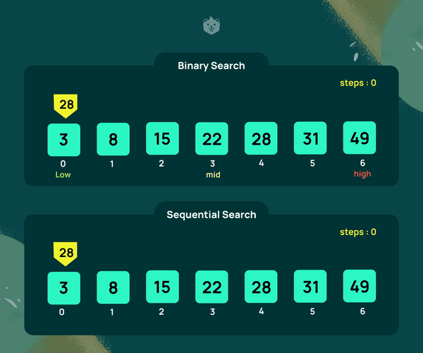
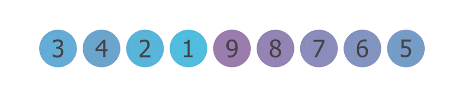
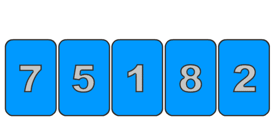
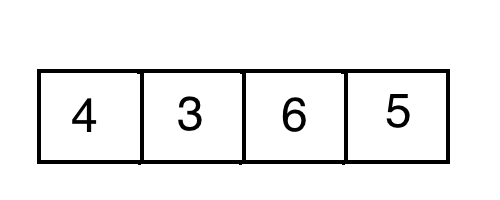

<div align="center">
<h2 align="center" id="searching">Searching and Sorting👀</h2>

| Time     | Level |
| :----:      |:----:|
| O(1)      | Excellent|
| O(log<sub>N</sub>)   | Good |
| O(N)   | Fair |
| O(N<sup>2</sup>)   | Poor (Bubble) |

<h3>Linear Search

- Sequential search order
- Time complexity based on # of elements
- Time Complexity: O(N) </h3>
```java
// linear(new String[]{"Alaska", "Ireland", "Niagra Falls"}, "Ireland")
public static int linear(String[] arr, String key){
    int result = -1;
    for (String e : arr){
        if (e == key) {
            result = 1;
            break;
        }
    }
    return result; // 1
}
```



<h3 align="center">Binary Search

- Array MUST BE SORTED
- Recursive
- Time Complexity: O(log<sub>N</sub>)
- Faster</h3>
```java
// binarySearch(new int[]{1,2,3,4,5,6,7,8,9}, 2) 
public static int binarySearch(int arr[], int key){  
    int first = 0;
    int last = arr.length;
    int mid = (first + last)/2;  

    while( first <= last ){  

        if ( arr[mid] < key ){  
            first = mid + 1;     
        }else if ( arr[mid] == key ){  
            break;  
        }else{  
            last = mid - 1;  
        }  
        mid = (first + last)/2; 

    }  
    // return -1 if not found, or found
    return ( first > last ) ? -1 : mid;
}
```


<h3>Bubble Sort

- Double for loop
- Swaps out larger element
- Time Complexity: O(N<sup>2</sup>)</h3>


```java
// linear(new String[]{"Alaska", "Ireland", "Niagra Falls"}, "Ireland")
// bubble_sort(new int[]{3,4,2,1,9,9,7,6,5}) ;
public static void bubble_sort(int[] arr){
    int temp = 0;
    for (int j = arr.length-1; j > 1; j--){
        for( int i= 0; i < j; i++){
            if (arr[i] > arr[i+1]){
                temp = arr[i];
                arr[i] = arr[i+1];
                arr[i+1] = temp;
            }
        }

    }
    // 123456799
}
```

<h3>Selection Sort

- Improvement on bubbe sort
- Reduces # of swaps
- Less memory
- Time Complexity: O(N<sup>2</sup>)</h3>


```java
// linear(new String[]{"Alaska", "Ireland", "Niagra Falls"}, "Ireland")
//selection_sort(new int[]{3,4,2,1,9,9,7,6,5}) 
public static void selection_sort(int[] arr){
    // forward loop
    for (int i = 0; i < arr.length-1; i++){
        int min = i;
        for(int j = i+1; j < arr.length; j++){
            //if left is greater than right, swap
            if (arr[j] < arr[min]) {
                min = j;
            }
        }
        // swap
        int temp = arr[i];
        arr[i] = arr[min];
        arr[min] = temp;
        
    }
    // 123456799
}
```


<h3>Insertion Sort

- somewhat the best
- twice as fast as bubble
- Time Complexity: O(N<sup>2</sup>)</h3>


```java
    // insertion_sort(new int[]{3,4,2,1,9,9,7,6,5})
    public static void insertion_sort(int[] arr)    {
        int n = arr.length;
        for (int i = 1; i < n; ++i) {
            int key = arr[i];
            int j = i - 1;
            while (j >= 0 && arr[j] > key) {
                arr[j + 1] = arr[j];
                j = j - 1;
            }
            arr[j + 1] = key;
        }
         // 123456799
    }
```

</div>