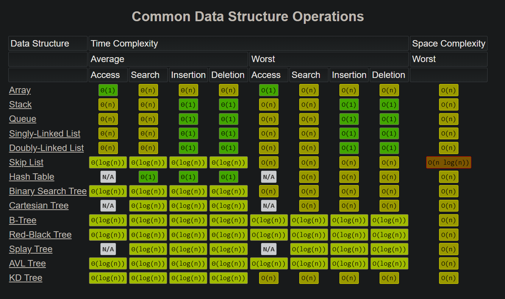

<table>
<tr>
<td>
    <table align="center">
        <tr>
            <td>
                Time
            </td>
            <td>
                Level
            </td>
        </tr>
        <tr>
            <td>
                O(1)
            </td>
            <td>
                Excellent
            </td>
        </tr>
        <tr>
            <td>
                O(log<sub>N</sub>)
            </td>
            <td>
                Good
            </td>
        </tr>
        <tr>
            <td>
                O(N)
            </td>
            <td>
                Fair
            </td>
        </tr>
        <tr>
            <td>
                O(N<sup>2</sup>)
            </td>
            <td>
                Poor (Bubble)
            </td>
        </tr>
        </table>
</td>
<td>
    <h1 align="center" fill="blue" id="searching">Searching and Sorting👀</h1>
</td>
</tr>

<tr>
<td>
<h3>Linear Search

- Sequential search order
- Time complexity based on # of elements
- Time Complexity: O(N)</h3>
</td>
<td>

```java
// linear(new String[]{"Alaska", "Ireland", "Niagra Falls"}, "Ireland")
public static int linear(String[] arr, String key){
    int result = -1;
    for (String e : arr){
        if (e == key) {
            result = 1;
            break;
        }
    }
    return result; // 1
}
```

</td>
</tr>
<tr>
<td>


<h3>Binary Search

- Array MUST BE SORTED
- Recursive
- Time Complexity: O(log<sub>N</sub>)
- Faster</h3>
</td>
<td>

```java
// binarySearch(new int[]{1,2,3,4,5,6,7,8,9}, 2) 
public static int binarySearch(int arr[], int key){  
    int first = 0;
    int last = arr.length;
    int mid = (first + last)/2;  

    while( first <= last ){  

        if ( arr[mid] < key ){  
            first = mid + 1;     
        }else if ( arr[mid] == key ){  
            break;  
        }else{  
            last = mid - 1;  
        }  
        mid = (first + last)/2; 

    }  
    // return -1 if not found, or found
    return ( first > last ) ? -1 : mid;
}
```
</td>
<tr>
<td>
</td>
<td>

</td>
</tr>


<tr>
<td>
<h2>Bubble Sort</h2>

- Double for loop
- Swaps out larger element
- Time Complexity: O(N<sup>2</sup>)

</td>
<td>

```java
// linear(new String[]{"Alaska", "Ireland", "Niagra Falls"}, "Ireland")
// bubble_sort(new int[]{3,4,2,1,9,9,7,6,5}) ;
public static void bubble_sort(int[] arr){
    int temp = 0;
    for (int j = arr.length-1; j > 1; j--){
        for( int i= 0; i < j; i++){
            if (arr[i] > arr[i+1]){
                temp = arr[i];
                arr[i] = arr[i+1];
                arr[i+1] = temp;
            }
        }

    }
    // 123456799
}
```

</td>
</tr>

<tr>
<td>
<h3>Selection Sort</h2>

- Improvement on bubbe sort
- Reduces # of swaps
- Less memory
- Time Complexity: O(N<sup>2</sup>)

</td>
<td>

```java
// linear(new String[]{"Alaska", "Ireland", "Niagra Falls"}, "Ireland")
//selection_sort(new int[]{3,4,2,1,9,9,7,6,5}) 
public static void selection_sort(int[] arr){
    // forward loop
    for (int i = 0; i < arr.length-1; i++){
        int min = i;
        for(int j = i+1; j < arr.length; j++){
            //if left is greater than right, swap
            if (arr[j] < arr[min]) {
                min = j;
            }
        }
        // swap
        int temp = arr[i];
        arr[i] = arr[min];
        arr[min] = temp;
        
    }
    // 123456799
}
```
</td>
</tr>

<tr>
<td>
<h2>Insertion Sort</h2>

- somewhat the best
- twice as fast as bubble
- Time Complexity: O(N<sup>2</sup>)

</td>
<td>

```java
    // insertion_sort(new int[]{3,4,2,1,9,9,7,6,5})
    public static void insertion_sort(int[] arr)    {
        int n = arr.length;
        for (int i = 1; i < n; ++i) {
            int key = arr[i];
            int j = i - 1;
            while (j >= 0 && arr[j] > key) {
                arr[j + 1] = arr[j];
                j = j - 1;
            }
            arr[j + 1] = key;
        }
         // 123456799
    }
```
</td>
</tr>
</table>
<!-- sorting graphs -->
<div align="center">
<!-- data structures -->

</div>
<div align="center">
<!-- sorting algos -->

</div>

<!-- 
ARRAYS
 -->
<h1>
    Arrays
</h1>

```java
public class Arr{
    // define a reference to an array
    // // int[] arr = new int[100]
    int[] arr; 
    int[] auto;

    public Arr(){
        // creates new array
        // sets reference to arr
        arr = new int[10];
        // numbers within the curly brackets 
        // are called the INITIALIZATION LIST.
        int[] a = {0, 3, 6, 9, 12, 15, 18, 21, 24, 27};
        auto = a;

        this.setNums();
    }

    // ACCESSORS
    public int getLength(){
        return arr.length;
    }
    public int getElement(int num){
        return arr[num];
    }
    public int getIndex(int num){
        int found = -1;
        for (int i=0; i<arr.length; i++){
            if (arr[i] == num) found=i;
        }
        return found;
    }
    public void printAll(){
        for(int i=0; i<arr.length; i++){
            System.out.println(arr[i]);
        }
    }
    public void printAutoGen(){
        for(int i=0; i<auto.length; i++){
            System.out.println(auto[i]);
        }
    }
    // LINEAR SEARCH:
    // iterate though one element at a time
    // runtime complexity: O(n)
    // - slow for large data sets
    // + fast for s-m data sets
    // + doesn't need to be storted
    // + useful for data structures that do not 
    //      have random access structrues (linked list)
    public int linearSearch(int num){
        int found = -1;
        for (int i=0; i<arr.length; i++){
            if (arr[i] == num) found=i;
        }
        return found;
    }
    // BINARY SEARCH:
    // opening in the middle
    // runtime complexity: O(log n)
    // + faster
    // - only works on sorted arrays
    public int binarySearch(int target){
        int found = -1;
        int start  = 0;
        int end = arr.length-1;
        while (start <= end){
        // when start = 9 and 9=9 => we are at the end
            int mid  = start + (end - start) / 2;
            // calculate the mid point
            // 0 + (9-0) /  2
            // 0 +   9   /  2
            // 0 +       4
            //           4
            System.out.printf("Start: %d\nMid: %d\nEnd: %d\n\n", start, mid, end);
            if (arr[mid] == target) {
                found = mid;
                break;
            } else if (arr[mid] > target){
                // if mid is greater -> target < mid
                // would like to only search left side
                // meaning that we will cut out the whole right side
                end = mid-1;
                // end is left index
            } else {
                // mid is less -> mid < target
                // only search right side
                // cut out the whole left side
                start = mid + 1;
                // start is right index
            }
        }
        return found;
    }

    // MUTATORS
    public int[] setNums(){
        this.arr[0] = 0;                 // insert 10 items
        this.arr[1] = 1;
        this.arr[2] = 2;
        this.arr[3] = 3;
        this.arr[4] = 4;
        this.arr[5] = 5;
        this.arr[6] = 6;
        this.arr[7] = 7;
        this.arr[8] = 8;
        this.arr[9] = 9;
        return this.arr;
    }
    public int setIndexElement(int i, int num){
        return this.arr[i] = num;
    }

    public static void main(String[] args) {
        Arr test = new Arr();
        System.out.println( test.binarySearch(20) );
        
    }
}
```

<!-- 
ARAYLIST AND LINKED LIST
 -->


<!-- 
CHAPTER 2
 -->
<table>
<tr>
<td>
    <h1> ArrayList and LinkedList</h1>
</td>
<td>

``` cpp
for (String e : places) System.out.println(e);
System.out.println(linkList);
System.out.println(arrList);
```

</td>
</tr>
<tr>
<td>

</td>
<td>

</td>
</tr>
<tr>
<td>
<h2> ArrayList </h2>

- `Regular array` inside it.
- Element is added by `placing` it `into` the `array`.
- A `new, larger` array is created if it is not big enough.
- `Old one is removed`.
</td>
<td>

```java
// one line
 ArrayList<String> arrList = new ArrayList<>( Arrays.asList("Alaska", "Canda") );
//  empty
rrayList<Object> arrList = new ArrayList<Object>()
```
</td>
</tr>
<tr>
<td>
<h2> LinkedList </h2>

- Items are `stored in containers`.
- List `links to the first` container.
- Each container `links to the next`.
- `New element` is `placed in a container` and `linked to one of the other` containers.
</td>
<td>

```java
LinkedList<String> linkedList = new LinkedList<>( Arrays.asList("Alaska", "Canda") );
LinkedList<Object> linkedL = new LinkedList<Object>();
```
</td>
</tr>

</table>

