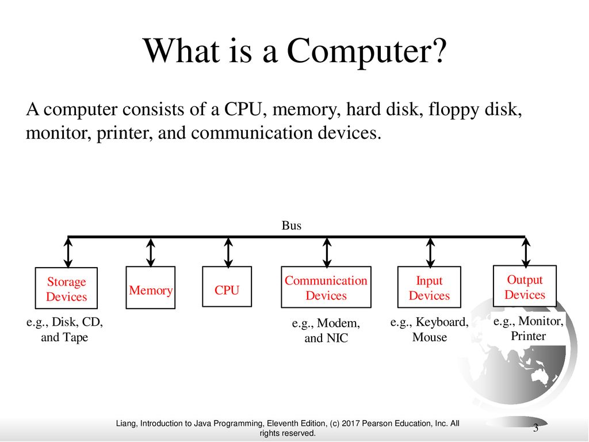

**bold**
: lala

<table>
<tr>
<td>
</td>
<td>

## 1. Introduction to Computers, Programs, and Java
</td>
</tr>
<!--  -->
<tr>
<td>

### A. What is a Computer
</td>
<td>

- Central Processing Unit (CPU)
- Memory (main)
- Storage Devices (disks and CDs)
- Input Devices (mouse and keyboard)
- Output Devices (monitors and printers)
- Communication Devices (modems and Network Interface Cards NIC)

</td>
</tr>
<!--  -->
<tr>
<td>
</td>
<td>

- **Bus**: *interconnects* computer's components. 
- **Motherboard** : *curcuit case* that connects the bus to the other components.
</td>
</tr>
<!--  -->
<tr>
<td>

### B. Central Processing Unit CPU
The computer's brain
</td>
<td>

- **Control Unit** : controls and coordinates the actions of other components.
- **Arithmetic/Logic Unit(ALU)** : performs numeric operations and logical operations.
- **Transistors** : small silicon 
</td>
</tr>
<!--  -->
<tr>
<td>

****
</td>
<td>
</td>
</tr>
<!--  -->
<tr>
<td>

****
</td>
<td>
</td>
</tr>
<!--  -->
<tr>
<td>

****
</td>
<td>
</td>
</tr>
</table>

<!-- 👣FOOTER👣 -->
&nbsp;

A work by <a href="https://github.com/xtina-lt/">Christina Torres</a>

<em>xtina_lt@outlook.com</em>

<!-- Add icon library -->
<link rel="stylesheet" href="https://cdnjs.cloudflare.com/ajax/libs/font-awesome/4.7.0/css/font-awesome.min.css">

<!-- Add font awesome icons -->

    
    

&nbsp;

