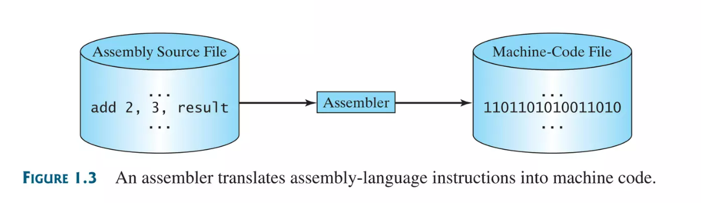

<table>
<tr>
<td>
</td>
<td>

## 1. Introduction to Computers, Programs, and Java
- I. What is a Computer
- II. Programming Languages
- III. Operating Systems
- IV. 
</td>
</tr>
<!--  -->
<tr>
<td>

### I. What is a Computer
</td>
<td>

- A.  Central Processing Unit (CPU)
- B. Memory (main)
- C. Storage Devices (disks and CDs)
- D. Input Devices (mouse and keyboard)
- E. Output Devices (monitors and printers)
- F. Communication Devices (modems and Network Interface Cards NIC)

</td>
</tr>
<!--  -->
<tr>
<td>
</td>
<td>

- _**Bus**_: *interconnects* computer's components. 
- _**Motherboard**_ : *curcuit case* that connects the bus to the other components.

</td>
</tr>
<!--  -->
<tr>
<td>

#### A. Central Processing Unit(CPU)
</td>
<td>

- _**Central Processing Unit(CPU)**_: the computer's _brain_.
- _**Control Unit**_: controls and _coordinates_ the _actions_ of other components.
- _**Arithmetic/Logic Unit(ALU)**_: performs _numeric_ operations and _logical operations_.
---
- _**Transistors**_: tiny electric _switches_ for processing information. _CPU's_ are _built on_ small _silicon semiconductor chips_ that contain millions of **transistors**.
---
- _Clock **Speed**_: _measurement_ of _internal clock_ that _emits electronic pulses_ at a constant rate. Higher = more.
- 1 _Hertz (Hz)_: 1 _pulse_ per second.
- 1 _MegaHertz (MHz)_: 1 _million_ pulses per second.
- 1 _GigaHertz (Hz)_: 1 _billion_ pulses per second.
- **_Core_**: part of the processor that performs the _reading_ and _executing_ of _instructions_.
</td>
</tr>
<!--  -->
<tr>
<td>

#### B. Memory Main

</td>
<td>

##### Bits and Bytes 
_A computer is really nothing more than a series of switches_. Each switch exists in two states: _on or off_. toring information in a computer is simply a matter of setting a sequence of switches **on(1)** or **off(0)**.
- _**Bits**_: _0's and 1's interpreted as digits_ in the binary number system aka _Binary Digits_.
- _**Byte**_: _minimum storage unit_ in a computer, <u>1 byte = 8 bits</u>.
- _**Encoding Scheme**_: _set of rules_ that govern how a _computer translates_ characters and numbers into data with which the computer can actually work.
---
- 1 kilobyte (KB) = 1 thousand bytes
- 1 megabyte (MB) = 1 million bytes.
- 1 gigabyte (GB) = 1 billion bytes.
- 1 terabyte (TB) = 1 terabyte bytes.

ASCII encoding scheme **C** is represented as **01000011** in **1 byte**.

20KB = 1 page doc, 1MB = 50 pages, 1 GB = 50,000. 2 HR high res movie = 8 GB.

---
##### Memory

- _**Memory**_: _ordered sequence_ of bytes for _storing_ programs as well as data with which the program is working..
- _**Unique Address**_: _address_ for every _byte_ in memory to locate for _storing_ and _retrieving_ the _data_.
- _**RAM**_: aka **Random Access Memory**, _bytes in memory_ that can be _acceessed in any order_. _**Volitile**_, *memory is lost when powered off*. 


A memory byte is never emmpty, content may be meaningless to your program. Current content gets replaced.

Built on silicone semiconductor chips that have milllions of transistors embedded on their surface. Compared to CPU chips, memory chips are less complicated, slower, and less expensive.
</td>
</tr>
<!--  -->
<tr>
<td>

#### C. Storage Devices
</td>
<td>

- **4 main types**: **Magnetic Disk Drives**, **Optical Disc Drives** (CD's and DVD's), **Universal Serial Bus (USB)** **flash drives**, and **Cloud Storage**.
- _**Storage Devices**_: Programs and data that are _permenantly stored_ and _non-volitile_. _Moved_ when the computer uses them for _higher speeds_.
- _**Drives**_: _devices_ for _operating_ a _medium_. Medium(physical storage) -> Drive (reads data / writes data) -> Back to Medium
- _**Hard Disks**_: _permanenetly storing data_ and programs and are _usually encased_ inside the computer. Removable is also available now.
- _**CD's**_: CD-ROM(prepressed), CD-R(recordable), CD-RW(re-writable), DVD(digital versatile disc or digitial video disc), DVD-R, DVD-RW.
- _**Universal Serial Bus(USB)**_: _connectors_ that allow the user to attatch many kinds of _peripheral devices_ to the computer.
- _**Flash Drive**_: _small protable device_ used for storing and transporting data. Can be _plugged into computer's USB port_.
</td>
</tr>
<!--  -->
<tr>
<td>

#### D/E. Input and Output Devices (I/O Devices)
</td>
<td>

- _**Input and Output Devices(I/O)**_: let the _user communicate_ with the _computer_.
---
- _**Input**_: keyboard, mouse.
- _**Keyboard**_: _device_ to _enter input_. Function keys, modifyer keys(shift, alt, ctrl), numeric keypad, arrow keys, word processing(insert, delete, page up, page down).
- _**Mouse**_: _pointing device_, moves a graphical pointer _curser_.
---
- _**Output**_: monitors, printers.
- _**Monitor**_: displays information (text and graphics). 
- _**Pixels**_: tiny _dots_ that _form an image_ on the screen. 
- _**Screen Resoluiton**_: specifies the number of _pixels_ in _horizonal_ and _vertical_ dimensions of a display device. 
- _**Dot Pitch**_: amount of _space between pixels_. 
- **Sharper image: **⬆️**Resolution && **⬇️**Dot Pitch**
- _**Touchscreen**_: cellphones, tablets, appliences, electronic voting machines.
</td>
</tr>
<!--  -->
<tr>
<td>

#### F. Communication Devices
Computers can be networked through communication devices, such as a dial-up modem, DSL or cabel modem, wired NIC, or wiredless adabpter
</td>
<td>

- _**Dial-Up Modem**_: phone line to dial a phone number and connect to internet. Can transfer data at 56,000 bits per second.
- _**Digital Subscriber Line(DSL)**_: standard phone line transfers 20x faster, replaced by DSL and cable modem.
- _**Cable Modem**_: cable company faster than DSL.
- _**Network Interface Card(NIC)**_: computer ↔️ local area network(LAN) ↔️ limited area(school, home, office), 1000 million bits per second. 
- _**Wi-Fi**_: _wireless router_ is a device that performs the functions of a router and also includes the functions of a _wireless access point_.
</td>
</tr>
<!--  -->
<tr>
<td>

#### G. Programming Languages
Computer programs, known as software, are instructions that tell a computer what to do.
</td>
<td>

- _**Low-Level language/Assembly Language**_: short descriptive word (_**mnemonic**_) used to represent each machinge-language instruction. `add`, `subtract`. Ex. Add numbers 2 and three and get result = `add 2, 3, result`.
- _**Assembler**_: translates assembly-language into machine code.

---
- _**Machine Language**_: computer's native _binary_ instruction language.
---

- _**High-Level Language/Source Program/Source Code**_:  instructional _**statements**_ similiar to English (can be used in many OS's). Must be translated by an interpreter or a compiler.
- _**Interpreter**_: _translates_ _high-level_/source code into _machine language_. Reads one statement at a time, translates it to the machine or vm, and executes.
- _**Compiler**_: _translates_ _high-level_/source code into _machine language_. Translates entire source code/high level language into a machine-code file, then executed.

</td>
</tr>
<!--  -->
<tr>
<td>

#### H. Operating Systems

</td>
<td>

- _**Operating Systems**_: manages and controls a computer's activites. Windows, Mac, and Linux. 1. Controls and monitor system activities. 2. Allocates and assigns system recources. 3. Schedules operations.
- _**Multiprogramming**_: _multiple programs_, _1 CPU_.
- _**Multithreading**_: _1 program_ can execute _multiple tasks_.
- _**Multiprocessing**_: _multiple programs_, _multiple CPU_'s.
</td>
</tr>
<!--  -->
<tr>
<td>

#### I. Java History
</td>
<td>

- James Gosling @ Sun Microsystems
- Purchased by Oracle in 2010.
- Origionally called Oak 1991 design.
- Electronic applications
- 1995 renamed to Java.
</td>
</tr>
<!--  -->
</tr>
<td>

#### J. Java Basics
</td>
<td>


```java
/* I am a multi
* line comment
*/
public class Welcome{
    // javac Welcome.java
    // java Welcome
    public static void main(String[] args) {
        System.out.println("Hello Unicorn");
    }
}
```


**Errors**: Syntax, Runtime, Logical
- **_Syntax Errors or Compile Errors_**: _detected by the compiler_, _missing braces_.
- **_Runtime Errors_**: errros that cause a program to _terminate abnormally_, _input error_.
- **_Logic Errors_**: _algo_, shows with result.
</td>
</tr>
</table>


<!-- 👣FOOTER👣 -->
&nbsp;
<hr />
<p align="center">A work by <a href="https://github.com/xtina-lt/">Christina Torres</a></p>
<p align="center"><span style="color: #808080;"><em>xtina_lt@outlook.com</em></span></p>

<!-- Add icon library -->
<link rel="stylesheet" href="https://cdnjs.cloudflare.com/ajax/libs/font-awesome/4.7.0/css/font-awesome.min.css">

<!-- Add font awesome icons -->
<p style="text-align: center;">
    <a href="https://www.linkedin.com/in/xtinacodes/" class="fa fa-linkedin"></a>
    <a href="https://github.com/xtina-lt/" class="fa fa-github"></a>
</p>

&nbsp;


